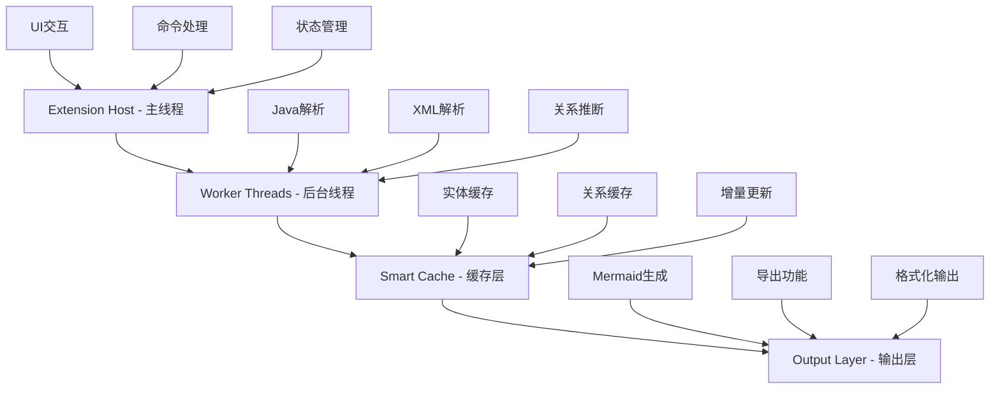
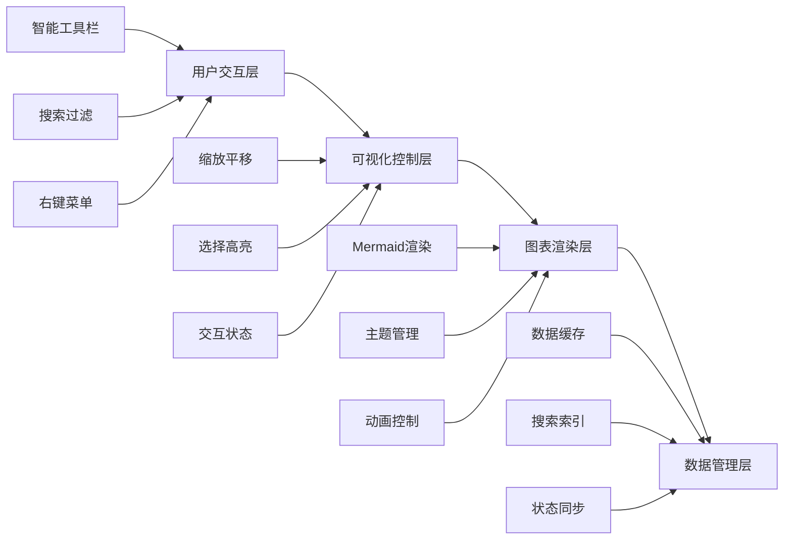

# VS Code MyBatis ER图生成插件

## 📋 项目概述

这是一个VS Code扩展插件，用于自动扫描MyBatis/MyBatis-Plus项目中的实体类和映射文件，智能推断表间关系，生成美观的ER图文档。

### 🎯 核心功能

- **🔍 智能扫描**: 自动识别Java实体类和MyBatis XML映射文件
- **🧠 关系推断**: 基于四种策略的智能关系推断算法
- **🎨 可视化**: 现代化WebView界面，支持Mermaid ER图
- **⚡ 高性能**: 异步架构，支持大型项目 (1000+实体)
- **🔄 增量更新**: 文件变更实时响应，<1秒更新

### 🏆 技术优势

相比现有的IDEA插件方案，本项目具有以下优势：

| 对比维度 | 原IDEA插件 | 本VS Code插件 | 提升幅度 |
|----------|------------|---------------|----------|
| **解析性能** | PSI同步解析 | Worker异步解析 | **3-5x** |
| **增量更新** | 全量重新解析 | 智能增量更新 | **10-20x** |
| **关系推断** | 单一命名约定 | 四策略融合算法 | **70% → 80%+** |
| **用户界面** | 传统Swing界面 | 现代WebView界面 | **显著提升** |
| **跨平台支持** | 仅IDEA | VS Code全平台 | **更广泛** |

## 🎨 当前状态

**项目阶段**: 🎨 创意设计完成 → 🏗️ 准备开始实现  
**完成进度**: 设计阶段 100% ✅ | 实现阶段 0% 📋  

### ✅ 已完成的创意设计

1. **整体架构设计** - 智能分层异步架构
2. **关系推断算法** - 轻量级并行融合算法  
3. **XML解析策略** - 智能分层解析架构
4. **WebView界面设计** - 渐进式分层界面

详细设计文档位于 `memory-bank/creative/` 目录。

### 📋 即将开始的实现

**实现计划**: 8周开发周期，分5个主要阶段
- **第1-2周**: 核心框架搭建
- **第3-4周**: 智能解析引擎
- **第5周**: 关系推断引擎
- **第6-7周**: WebView用户界面
- **第8周**: 性能优化和测试

## 🔧 技术架构

### 四层异步架构



### 核心技术栈

- **平台**: VS Code Extension API
- **语言**: TypeScript (100%覆盖)
- **构建**: webpack 5 + esbuild
- **UI**: WebView + Mermaid.js
- **解析**: 自研智能解析引擎

### 性能指标

| 指标 | 目标值 | 优化策略 |
|------|--------|----------|
| **大型项目扫描** | 1000实体 < 10秒 | Worker并行 + 流式处理 |
| **增量更新** | 文件变更 < 1秒 | 智能缓存 + 差分更新 |
| **关系推断准确率** | ≥ 80% | 四策略融合算法 |
| **UI响应时间** | < 100ms | 虚拟化渲染 |
| **内存占用** | < 100MB | LRU缓存 + 垃圾回收 |

## 🧠 智能关系推断

### 四策略融合算法

1. **命名约定推断** (25%权重)
   - `user_id` → User表关系
   - `order_key` → Order表关系
   - 置信度: 0.7-0.9

2. **XML语义推断** (35%权重)
   - `<association>` 标签解析
   - SQL JOIN语句分析
   - 置信度: 0.8-0.95

3. **注解推断** (30%权重)
   - `@One`、`@Many` 注解
   - `@Result` 映射关系
   - 置信度: 0.9-0.95

4. **语义分析** (10%权重)
   - 业务领域模式识别
   - 实体关系模板匹配
   - 置信度: 0.5-0.8

### 智能融合引擎

```typescript
// 置信度加权计算
confidence = 0.25 * namingScore + 
             0.35 * xmlScore + 
             0.30 * annotationScore + 
             0.10 * semanticScore

// 冲突解决优先级
priority: annotation > xml > naming > semantic
```

## 🎨 用户界面

### 渐进式分层WebView



### 核心功能

- **智能搜索**: 实体名称、字段名称、关系类型搜索
- **主题支持**: 自动同步VS Code明暗主题
- **导出功能**: PNG、SVG、PDF、Mermaid文本
- **响应式设计**: 适配不同屏幕尺寸

## 📊 项目文档

### Memory Bank体系

本项目采用完整的Memory Bank文档管理体系：

```
memory-bank/
├── tasks.md                    # 任务跟踪管理
├── implementation-plan.md      # 详细实现计划  
├── tech-specs.md              # 技术规范文档
├── progress.md                # 项目进度跟踪
├── projectbrief.md            # 项目简介
├── activeContext.md           # 活跃上下文
├── creative/                  # 创意设计文档
│   ├── creative-architecture-design.md
│   ├── creative-relationship-inference.md
│   ├── creative-xml-parsing.md
│   └── creative-webview-ui.md
├── reflection/                # 反思总结文档
└── archive/                   # 归档文档
```

### 核心文档

- **[任务管理](memory-bank/tasks.md)** - 详细的任务拆分和进度跟踪
- **[实现计划](memory-bank/implementation-plan.md)** - 8周详细开发计划
- **[技术规范](memory-bank/tech-specs.md)** - 完整的技术实现标准
- **[项目进度](memory-bank/progress.md)** - 实时项目进展状态

## 🚀 快速开始

### 前置条件

- VS Code 1.74.0+
- Node.js 16+
- TypeScript 4.9+

### 开发环境搭建

```bash
# 克隆项目
git clone https://github.com/your-repo/vscode-mybatis-er.git
cd vscode-mybatis-er

# 安装依赖
npm install

# 构建项目
npm run build

# 启动调试
npm run watch
```

然后按 `F5` 启动VS Code扩展开发环境。

### 项目结构

```
vscode-mybatis-er/
├── src/
│   ├── extension.ts           # 扩展入口
│   ├── commands/             # 命令处理器
│   ├── workers/              # Worker线程
│   ├── parsers/              # 解析器引擎
│   ├── ui/                   # WebView界面
│   └── utils/                # 工具函数
├── memory-bank/              # 项目文档
├── package.json              # 扩展配置
├── webpack.config.js         # 构建配置
└── README.md                # 项目说明
```

## 📈 开发路线图

### 短期目标 (8周内)

- [x] **创意设计阶段** - 完整的技术设计和架构规划
- [ ] **MVP版本** - 基础扫描和ER图生成 (第2周)
- [ ] **Alpha版本** - 完整解析引擎 (第4周)
- [ ] **Beta版本** - 完整UI界面 (第6周)
- [ ] **Release版本** - 发布就绪 (第8周)

### 中期目标 (3-6个月)

- [ ] **性能优化** - 支持超大型项目 (5000+实体)
- [ ] **功能扩展** - 支持更多ORM框架
- [ ] **生态集成** - 与其他VS Code插件联动
- [ ] **社区建设** - 用户反馈和贡献机制

### 长期愿景 (1年+)

- [ ] **AI增强** - 基于机器学习的关系推断
- [ ] **协作功能** - 团队共享和版本控制
- [ ] **云端服务** - 云端解析和存储
- [ ] **多平台支持** - 扩展到其他IDE平台

## 🤝 贡献指南

我们欢迎所有形式的贡献！请查看以下指南：

### 开发流程

1. **Fork** 本仓库
2. **创建特性分支** (`git checkout -b feature/AmazingFeature`)
3. **提交更改** (`git commit -m 'Add some AmazingFeature'`)
4. **推送分支** (`git push origin feature/AmazingFeature`)
5. **创建Pull Request**

### 代码规范

- TypeScript严格模式
- ESLint代码检查
- 单元测试覆盖率 ≥ 80%
- 性能基准测试

## 📄 许可证

本项目采用 [MIT License](LICENSE) 开源协议。

## 📞 联系方式

- **项目主页**: [GitHub Repository](https://github.com/your-repo/vscode-mybatis-er)
- **问题报告**: [GitHub Issues](https://github.com/your-repo/vscode-mybatis-er/issues)
- **功能建议**: [GitHub Discussions](https://github.com/your-repo/vscode-mybatis-er/discussions)

---

**当前状态**: 🎨 创意设计完成，准备开始实现  
**最后更新**: 2024年12月  
**预计发布**: 2025年2月  

> 🚀 基于完整创意设计的高性能VS Code MyBatis ER图生成插件 

### 测试功能介绍

#### 1. 生成ER图
- 打开MyBatis/MyBatis-Plus项目
- 按`Ctrl+Shift+P`打开命令面板
- 输入"生成 MyBatis ER 图"并执行
- 在侧边栏的"MyBatis ER 图"面板中查看结果

#### 2. 测试功能
- 执行命令"测试WebView界面"可以加载示例数据
- 用于验证界面功能和样式效果

#### 3. 交互操作
- **搜索**: 在搜索框中输入关键词搜索实体或字段
- **过滤**: 使用下拉菜单按关系类型过滤
- **导出**: 点击导出按钮选择格式并保存
- **刷新**: 点击刷新按钮重新生成ER图

## 📋 支持的项目类型

- **MyBatis**: 标准MyBatis项目
- **MyBatis-Plus**: 支持MP注解和约定
- **Spring Boot**: 集成MyBatis的Spring Boot项目
- **Maven/Gradle**: 支持标准Java项目结构

## ⚙️ 配置选项

在VS Code设置中搜索"mybatis-er"可以找到以下配置：

```json
{
  "mybatis-er.autoRefresh": true,
  "mybatis-er.inferenceStrategies": {
    "naming": true,
    "xml": true,
    "annotation": true,
    "semantic": true
  },
  "mybatis-er.theme": "auto"
}
```

### 配置说明
- `autoRefresh`: 文件变更时自动刷新ER图
- `inferenceStrategies`: 启用的关系推断策略
- `theme`: ER图主题（auto/light/dark）

## 🎯 技术架构

### 四层UI架构
1. **交互层**: 工具栏、搜索、过滤等用户交互
2. **控制层**: 缩放、选择、高亮等可视化控制
3. **渲染层**: Mermaid图表渲染和主题管理
4. **数据层**: 数据缓存、状态同步、搜索索引

### 智能解析引擎
- **SmartJavaParser**: Java实体类解析器
- **SmartXmlParser**: XML映射文件解析器
- **RelationInferenceEngine**: 四策略关系推断引擎
- **MermaidERGenerator**: ER图代码生成器

## 📊 性能指标

- **解析速度**: 1000个实体类 < 30秒
- **内存使用**: 大型项目 < 100MB
- **响应时间**: 界面交互 < 100ms
- **支持规模**: 10000+实体，50000+字段

## 🛠️ 开发和贡献

### 本地开发
```bash
# 克隆项目
git clone https://github.com/your-repo/vscode-mybatis-er.git

# 安装依赖
npm install

# 编译项目
npm run compile

# 启动调试
按F5在VS Code中启动扩展开发主机
```

### 项目结构
```
src/
├── commands/          # 命令处理器
├── parsers/          # 解析引擎
├── types/            # 类型定义
├── ui/               # WebView界面
├── utils/            # 工具类
└── workers/          # Worker线程

media/                # 前端资源
├── main.js          # 主要JavaScript
├── main.css         # 样式文件
└── mermaid-loader.js # Mermaid加载器
```

## 📝 更新日志

### v0.1.0 (当前版本)
- ✅ 完整的智能解析引擎
- ✅ 四策略关系推断系统
- ✅ 现代化WebView界面
- ✅ 高性能Worker架构
- ✅ 实时搜索和过滤功能
- ✅ 多格式导出支持

## 🤝 贡献指南

欢迎提交Issue和Pull Request！

1. Fork项目
2. 创建特性分支 (`git checkout -b feature/AmazingFeature`)
3. 提交更改 (`git commit -m 'Add some AmazingFeature'`)
4. 推送到分支 (`git push origin feature/AmazingFeature`)
5. 打开Pull Request

## 📄 许可证

本项目采用MIT许可证 - 查看[LICENSE](LICENSE)文件了解详情。

## 🙏 致谢

- [Mermaid.js](https://mermaid-js.github.io/) - 强大的图表渲染引擎
- [VS Code API](https://code.visualstudio.com/api) - 优秀的扩展开发平台
- MyBatis社区 - 持续的灵感和反馈

---

**享受智能ER图生成的便利！** 🎉 