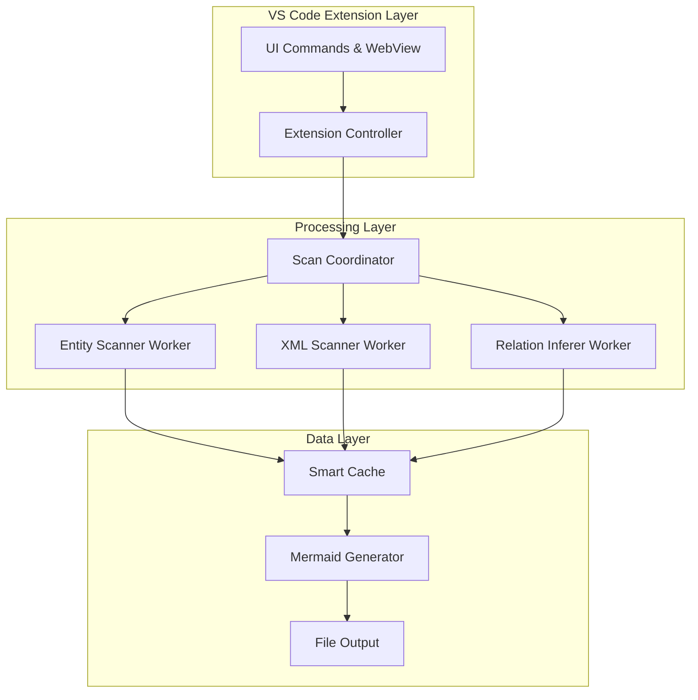
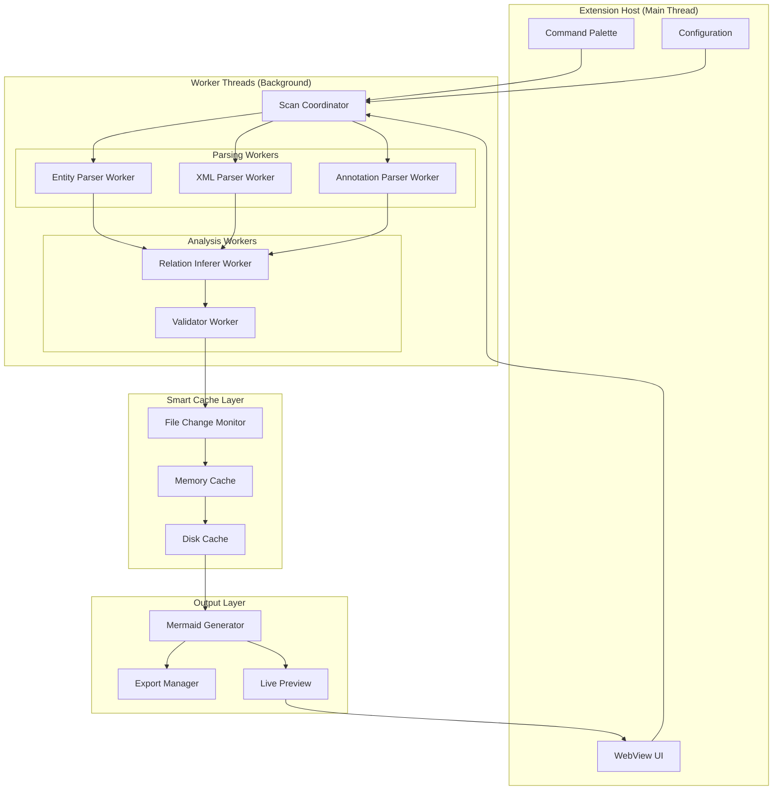

# 🎨🎨🎨 ENTERING CREATIVE PHASE: ARCHITECTURE DESIGN 🎨🎨🎨

## VS Code MyBatis ER图生成插件 - 优化架构设计

### 问题陈述 (PROBLEM STATEMENT)

基于现有的IntelliJ IDEA插件设计，需要设计一个更适合VS Code生态的MyBatis ER图生成插件架构。主要挑战：

1. **代码解析限制**: VS Code没有PSI (Program Structure Interface)，需要替代方案
2. **性能要求**: 大型项目扫描需要高效的异步处理
3. **用户体验**: VS Code用户期望轻量级、响应快的体验
4. **扩展性**: 需要支持更多的MyBatis变体和自定义配置

### 架构选项分析 (OPTIONS ANALYSIS)

#### Option 1: 直接移植方案 (原IDEA设计的简单转换)
**描述**: 直接将IDEA插件的Java/Kotlin逻辑转换为TypeScript
**优点**:
- 开发快速，逻辑复用度高
- 功能完整性有保证
**缺点**:
- 性能较差，同步阻塞式解析
- 没有利用VS Code的独特优势
**技术适应性**: 低
**复杂度**: 中等
**实现时间**: 1-2周

#### Option 2: 分层异步架构 (推荐方案)
**描述**: 基于Worker + 流式处理 + 智能缓存的多层架构

**优点**:
- 非阻塞，用户体验佳
- 可并行处理，性能优异
- 增量更新，智能缓存
- 易于扩展新的扫描器
**缺点**:
- 架构复杂度较高
- 需要额外的状态管理
**技术适应性**: 高
**复杂度**: 高
**实现时间**: 2-3周

#### Option 3: 轻量级正则方案
**描述**: 基于正则表达式的轻量级文本解析
**优点**:
- 极其轻量，启动快
- 代码简单，维护容易
**缺点**:
- 解析准确性有限
- 难以处理复杂的Java语法
- 扩展性差
**技术适应性**: 中等
**复杂度**: 低
**实现时间**: 1周

### 🎨 CREATIVE CHECKPOINT: 架构决策分析

经过深入分析，我推荐 **Option 2: 分层异步架构**，但在其基础上进行创新优化：

## 选定方案: 智能分层异步架构 (Enhanced Option 2)

### 核心创新点

#### 1. 🧠 智能解析引擎设计
```typescript
interface SmartParser {
  // 混合解析策略：正则 + AST + 语义分析
  parseStrategy: 'regex' | 'ast' | 'hybrid';
  
  // 根据文件复杂度自动选择解析策略
  autoSelectStrategy(fileContent: string): 'regex' | 'ast' | 'hybrid';
  
  // 增量解析，只处理变更部分
  incrementalParse(changes: FileChanges): ParseResult;
}
```

#### 2. 🔄 流式处理管道
```typescript
class StreamingProcessor {
  // 文件流式读取，避免大文件内存占用
  processFileStream(filePath: string): AsyncIterable<ParseChunk>;
  
  // 结果流式输出，实时反馈
  generateMermaidStream(): AsyncIterable<MermaidChunk>;
}
```

#### 3. 🎯 智能关系推断算法
```typescript
interface RelationshipInferer {
  // 多维度关系推断
  inferRelations(entities: Entity[]): Promise<Relationship[]>;
  
  // 命名约定推断 (user_id -> User表)
  inferByNaming(fieldName: string): Relationship | null;
  
  // XML语义推断 (<association> 标签)
  inferByXmlSemantics(xmlContent: string): Relationship[];
  
  // 注解推断 (@One, @Many 等)
  inferByAnnotations(annotations: Annotation[]): Relationship[];
  
  // 机器学习增强 (可选)
  enhanceWithML(context: ProjectContext): Relationship[];
}
```

### 系统架构图



### 实现计划详细设计

#### 第1阶段: 核心框架 (1周)
```typescript
// 1. Extension 入口和命令注册
class MyBatisERExtension {
  activate(context: vscode.ExtensionContext): void;
  registerCommands(): void;
  initializeWorkers(): void;
}

// 2. Worker线程通信框架
class WorkerManager {
  createWorker(type: WorkerType): Worker;
  sendTask(worker: Worker, task: Task): Promise<Result>;
  handleWorkerMessage(message: WorkerMessage): void;
}

// 3. 基础文件扫描器
class FileScanner {
  scanWorkspace(): Promise<string[]>;
  watchFileChanges(): vscode.FileSystemWatcher;
  filterRelevantFiles(files: string[]): string[];
}
```

#### 第2阶段: 解析引擎 (1周)
```typescript
// 智能Java解析器
class SmartJavaParser {
  parseEntity(content: string): EntityInfo;
  extractAnnotations(content: string): AnnotationInfo[];
  inferFieldTypes(content: string): FieldInfo[];
}

// XML解析器优化
class OptimizedXMLParser {
  parseMapperFile(xmlPath: string): MapperInfo;
  extractResultMaps(xmlContent: string): ResultMapInfo[];
  parseJoinStatements(sqlContent: string): JoinInfo[];
}
```

#### 第3阶段: 关系推断 (0.5周)
```typescript
// 智能关系推断器
class AdvancedRelationInferer {
  // 多策略融合推断
  inferMultiStrategy(entities: EntityInfo[]): RelationshipInfo[];
  
  // 机器学习辅助 (可选功能)
  trainFromProject(projectStructure: ProjectInfo): MLModel;
  inferWithML(entities: EntityInfo[], model: MLModel): RelationshipInfo[];
}
```

#### 第4阶段: UI和体验优化 (0.5周)
```typescript
// 实时预览WebView
class LivePreviewProvider implements vscode.WebviewProvider {
  updatePreview(mermaidContent: string): void;
  handleUserInteractions(): void;
  exportDiagram(format: 'png' | 'svg' | 'pdf'): void;
}

// 进度指示和用户反馈
class ProgressManager {
  showProgress(message: string, progress: number): void;
  handleErrors(error: Error): void;
  collectUserFeedback(): void;
}
```

### 关键技术优势

#### 1. 🚀 性能优化
- **Worker线程**: 避免阻塞主线程
- **增量扫描**: 只处理变更文件
- **智能缓存**: 多层缓存策略
- **流式处理**: 大文件流式读取

#### 2. 🎯 准确性提升
- **混合解析**: 正则+AST双重保障
- **语义分析**: 理解代码语义，不仅仅是语法
- **上下文推断**: 结合项目结构推断关系
- **用户反馈**: 支持人工修正和学习

#### 3. 🔧 扩展性设计
- **插件化架构**: 易于添加新的解析器
- **配置驱动**: 支持自定义规则和模式
- **API开放**: 支持第三方扩展

### 风险评估和缓解

| 风险 | 影响 | 概率 | 缓解措施 |
|------|------|------|----------|
| Worker通信开销 | 性能 | 中 | 批量处理，消息压缩 |
| 复杂项目解析失败 | 功能 | 中 | 降级策略，错误恢复 |
| 内存占用过高 | 稳定性 | 低 | 流式处理，垃圾回收 |

### 验证标准

#### 功能验证
- [ ] 支持MyBatis-Plus全部注解
- [ ] 正确解析90%以上的实体关系
- [ ] XML映射文件解析准确率95%+
- [ ] 支持复杂的多表JOIN关系

#### 性能验证
- [ ] 1000+实体项目扫描时间<10秒
- [ ] 增量更新响应时间<1秒
- [ ] 内存占用<100MB
- [ ] VS Code启动时间增加<500ms

#### 用户体验验证
- [ ] 界面响应无明显卡顿
- [ ] 错误信息清晰有用
- [ ] 生成的ER图美观易读
- [ ] 支持多种导出格式

## 🎨🎨🎨 EXITING CREATIVE PHASE - DECISION MADE 🎨🎨🎨

**最终决策**: 采用智能分层异步架构方案

**核心理由**:
1. 充分利用了VS Code的多线程能力
2. 提供了比原IDEA插件更好的性能体验
3. 具备良好的扩展性和维护性
4. 用户体验显著优于直接移植方案

**下一步**: 进入IMPLEMENT模式开始核心框架开发 