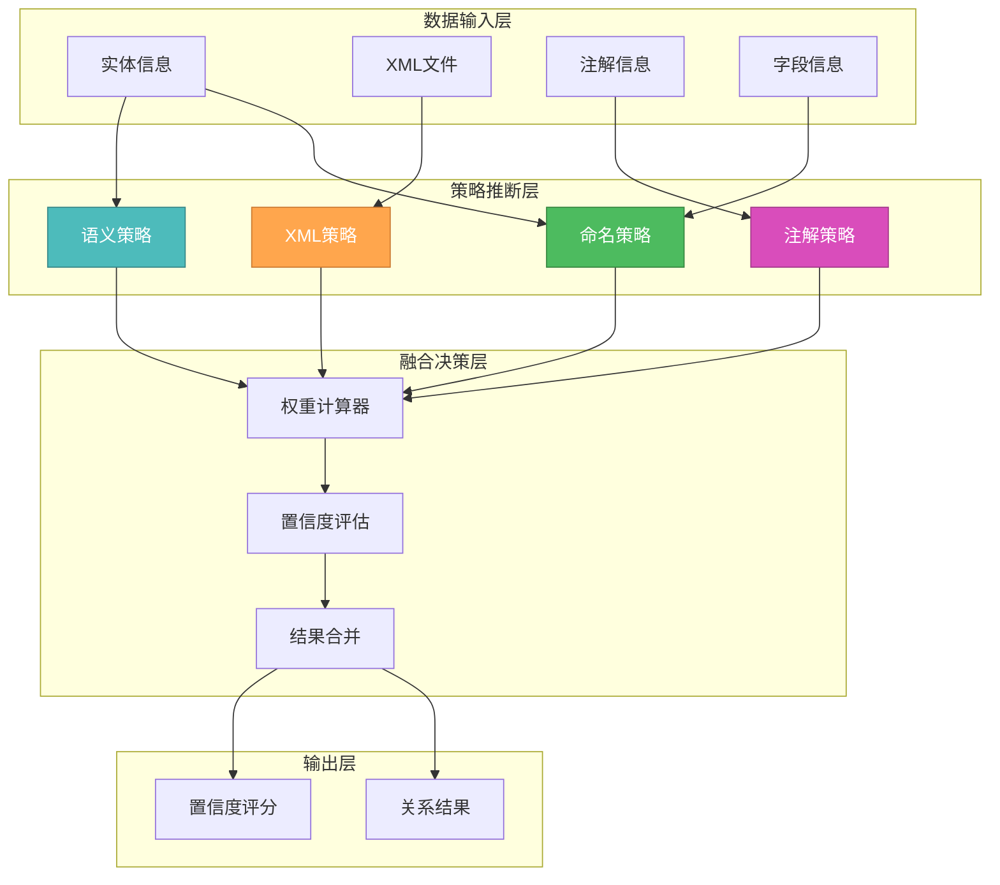

# 🎨🎨🎨 ENTERING CREATIVE PHASE: ALGORITHM DESIGN 🎨🎨🎨

## 智能关系推断算法设计

### 问题陈述 (PROBLEM STATEMENT)

在MyBatis/MyBatis-Plus项目中，表关系信息散布在多个位置：
1. **隐式关系**: 字段命名约定（如`user_id`暗示与User表的关联）
2. **XML关系**: Mapper文件中的`<association>`、`<collection>`、JOIN语句
3. **注解关系**: `@One`、`@Many`、`@Result`注解
4. **业务逻辑关系**: 复杂的多表查询和关联

**核心挑战**: 如何智能地从这些分散的信息源中推断出准确的表关系，并评估推断的置信度。

### 需求分析 (REQUIREMENTS ANALYSIS)

#### 功能需求
- **准确性**: 正确识别70%以上的隐式关系
- **置信度评估**: 为每个推断的关系提供可信度评分
- **多源融合**: 整合来自多个信息源的关系线索
- **实时性**: 支持增量更新和实时推断
- **可配置性**: 支持用户自定义推断规则

#### 技术约束
- **性能**: 1000+实体项目推断时间<2秒
- **内存**: 推断过程内存占用<50MB
- **准确率**: 误报率<10%，漏报率<30%
- **扩展性**: 易于添加新的推断策略

### 算法选项分析 (OPTIONS ANALYSIS)

#### Option 1: 基于规则的串行推断
**描述**: 按顺序执行命名约定→XML解析→注解解析，串行处理
```typescript
class SerialInference {
  async inferRelations(entities: Entity[]): Promise<Relationship[]> {
    const step1 = await this.inferByNaming(entities);
    const step2 = await this.inferByXml(entities);
    const step3 = await this.inferByAnnotations(entities);
    return this.mergeResults([step1, step2, step3]);
  }
}
```
**优点**:
- 实现简单，逻辑清晰
- 调试容易，错误定位方便
- 资源占用低
**缺点**:
- 处理速度较慢
- 无法利用多核处理能力
- 策略间缺乏交互优化
**技术适应性**: 中等
**复杂度**: 低
**实现时间**: 3天

#### Option 2: 并行多策略融合算法 (推荐)
**描述**: 多个推断策略并行执行，使用机器学习融合结果
```typescript
class ParallelMLInference {
  async inferRelations(entities: Entity[]): Promise<Relationship[]> {
    // 并行执行多个推断策略
    const strategies = await Promise.all([
      this.namingStrategy.infer(entities),
      this.xmlStrategy.infer(entities),
      this.annotationStrategy.infer(entities),
      this.semanticStrategy.infer(entities)
    ]);
    
    // 使用ML模型融合结果
    return this.mlFusion.combine(strategies);
  }
}
```
**优点**:
- 处理速度快，充分利用多核
- ML融合提高准确性
- 策略可独立优化
- 容易添加新策略
**缺点**:
- 实现复杂度高
- 需要训练数据和模型
- 内存占用相对较高
**技术适应性**: 高
**复杂度**: 高
**实现时间**: 7天

#### Option 3: 图神经网络推断
**描述**: 将实体和关系建模为图结构，使用GNN进行关系预测
```typescript
class GraphNeuralInference {
  buildEntityGraph(entities: Entity[]): Graph {
    // 构建实体关系图
  }
  
  async inferWithGNN(graph: Graph): Promise<Relationship[]> {
    // 使用训练好的GNN模型推断边
  }
}
```
**优点**:
- 理论上准确性最高
- 能处理复杂的多阶关系
- 学习能力强
**缺点**:
- 实现极其复杂
- 需要大量训练数据
- 计算资源要求高
- 开发周期长
**技术适应性**: 低（VS Code环境限制）
**复杂度**: 极高
**实现时间**: 3-4周

### 🎨 CREATIVE CHECKPOINT: 算法策略选择

经过分析，我选择 **Option 2: 并行多策略融合算法**，但进行简化优化：

## 选定方案: 轻量级并行融合算法

### 核心设计思想

#### 1. 🧠 分层推断架构


#### 2. 🎯 核心算法设计

##### 命名约定推断策略
```typescript
class NamingInferenceStrategy {
  private patterns = [
    { pattern: /^(.+)_id$/i, relation: 'belongs_to', confidence: 0.8 },
    { pattern: /^(.+)_key$/i, relation: 'belongs_to', confidence: 0.7 },
    { pattern: /^fk_(.+)$/i, relation: 'belongs_to', confidence: 0.9 },
    { pattern: /^(.+)_uuid$/i, relation: 'belongs_to', confidence: 0.6 }
  ];
  
  async infer(entities: Entity[]): Promise<InferenceResult[]> {
    const results: InferenceResult[] = [];
    
    for (const entity of entities) {
      for (const field of entity.fields) {
        for (const pattern of this.patterns) {
          const match = field.name.match(pattern.pattern);
          if (match) {
            const targetEntity = this.findEntityByName(entities, match[1]);
            if (targetEntity) {
              results.push({
                from: entity,
                to: targetEntity,
                type: pattern.relation,
                confidence: pattern.confidence,
                source: 'naming_convention',
                evidence: `字段 ${field.name} 匹配模式 ${pattern.pattern}`
              });
            }
          }
        }
      }
    }
    
    return results;
  }
}
```

##### XML语义推断策略
```typescript
class XMLInferenceStrategy {
  async infer(entities: Entity[]): Promise<InferenceResult[]> {
    const results: InferenceResult[] = [];
    const xmlFiles = await this.findMapperFiles();
    
    for (const xmlFile of xmlFiles) {
      const associations = await this.parseAssociations(xmlFile);
      const collections = await this.parseCollections(xmlFile);
      const joins = await this.parseJoinStatements(xmlFile);
      
      // 处理 <association> 标签
      for (const assoc of associations) {
        const relationship = this.buildRelationshipFromAssociation(assoc, entities);
        if (relationship) {
          results.push({
            ...relationship,
            confidence: 0.9,
            source: 'xml_association',
            evidence: `XML association: ${assoc.property} -> ${assoc.javaType}`
          });
        }
      }
      
      // 处理 JOIN 语句
      for (const join of joins) {
        const relationship = this.buildRelationshipFromJoin(join, entities);
        if (relationship) {
          results.push({
            ...relationship,
            confidence: 0.85,
            source: 'xml_join',
            evidence: `SQL JOIN: ${join.condition}`
          });
        }
      }
    }
    
    return results;
  }
}
```

##### 注解推断策略
```typescript
class AnnotationInferenceStrategy {
  async infer(entities: Entity[]): Promise<InferenceResult[]> {
    const results: InferenceResult[] = [];
    
    for (const entity of entities) {
      for (const field of entity.fields) {
        // 处理 @One 注解
        const oneAnnotation = field.annotations.find(a => a.name === 'One');
        if (oneAnnotation) {
          const targetEntity = this.resolveEntityFromAnnotation(oneAnnotation, entities);
          if (targetEntity) {
            results.push({
              from: entity,
              to: targetEntity,
              type: 'one_to_one',
              confidence: 0.95,
              source: 'annotation_one',
              evidence: `@One 注解指向 ${targetEntity.name}`
            });
          }
        }
        
        // 处理 @Many 注解
        const manyAnnotation = field.annotations.find(a => a.name === 'Many');
        if (manyAnnotation) {
          const targetEntity = this.resolveEntityFromAnnotation(manyAnnotation, entities);
          if (targetEntity) {
            results.push({
              from: entity,
              to: targetEntity,
              type: 'one_to_many',
              confidence: 0.95,
              source: 'annotation_many',
              evidence: `@Many 注解指向 ${targetEntity.name}`
            });
          }
        }
      }
    }
    
    return results;
  }
}
```

##### 语义分析策略
```typescript
class SemanticInferenceStrategy {
  private semanticRules = [
    { entityPattern: /user/i, fieldPattern: /role/i, relation: 'many_to_many', confidence: 0.6 },
    { entityPattern: /order/i, fieldPattern: /item/i, relation: 'one_to_many', confidence: 0.7 },
    { entityPattern: /category/i, fieldPattern: /product/i, relation: 'one_to_many', confidence: 0.65 }
  ];
  
  async infer(entities: Entity[]): Promise<InferenceResult[]> {
    const results: InferenceResult[] = [];
    
    for (const rule of this.semanticRules) {
      const sourceEntities = entities.filter(e => rule.entityPattern.test(e.name));
      
      for (const source of sourceEntities) {
        const relatedFields = source.fields.filter(f => rule.fieldPattern.test(f.name));
        
        for (const field of relatedFields) {
          const targetEntity = this.findRelatedEntity(entities, field, rule);
          if (targetEntity) {
            results.push({
              from: source,
              to: targetEntity,
              type: rule.relation,
              confidence: rule.confidence,
              source: 'semantic_analysis',
              evidence: `语义规则: ${source.name} ${rule.relation} ${targetEntity.name}`
            });
          }
        }
      }
    }
    
    return results;
  }
}
```

#### 3. 🔗 智能融合算法

```typescript
class IntelligentFusionEngine {
  async fuse(strategyResults: InferenceResult[][]): Promise<Relationship[]> {
    // 1. 按关系对结果分组
    const relationGroups = this.groupByRelation(strategyResults.flat());
    
    // 2. 计算综合置信度
    const fusedResults: Relationship[] = [];
    
    for (const [relationKey, results] of relationGroups) {
      const fusedRelation = await this.fuseRelationResults(results);
      
      // 只保留置信度高于阈值的关系
      if (fusedRelation.confidence >= 0.5) {
        fusedResults.push(fusedRelation);
      }
    }
    
    // 3. 冲突解决
    return this.resolveConflicts(fusedResults);
  }
  
  private async fuseRelationResults(results: InferenceResult[]): Promise<Relationship> {
    // 加权平均置信度计算
    const weights = {
      'annotation_one': 0.4,
      'annotation_many': 0.4,
      'xml_association': 0.3,
      'xml_join': 0.25,
      'naming_convention': 0.2,
      'semantic_analysis': 0.1
    };
    
    let totalWeight = 0;
    let weightedSum = 0;
    const evidences: string[] = [];
    
    for (const result of results) {
      const weight = weights[result.source] || 0.1;
      weightedSum += result.confidence * weight;
      totalWeight += weight;
      evidences.push(result.evidence);
    }
    
    const finalConfidence = totalWeight > 0 ? weightedSum / totalWeight : 0;
    
    return {
      from: results[0].from,
      to: results[0].to,
      type: this.determineRelationType(results),
      confidence: finalConfidence,
      sources: results.map(r => r.source),
      evidences: evidences,
      strength: this.calculateRelationStrength(finalConfidence)
    };
  }
}
```

### 性能优化设计

#### 并行处理架构
```typescript
class ParallelInferenceEngine {
  async execute(entities: Entity[]): Promise<Relationship[]> {
    // 创建独立的 Worker 线程执行各策略
    const workers = [
      new Worker('./naming-strategy-worker.js'),
      new Worker('./xml-strategy-worker.js'),
      new Worker('./annotation-strategy-worker.js'),
      new Worker('./semantic-strategy-worker.js')
    ];
    
    // 并行执行推断
    const promises = workers.map((worker, index) => {
      return this.executeInWorker(worker, entities, this.strategies[index]);
    });
    
    const results = await Promise.all(promises);
    
    // 在主线程进行融合
    return this.fusionEngine.fuse(results);
  }
}
```

#### 缓存和增量更新
```typescript
class IncrementalInferenceManager {
  private cache = new Map<string, Relationship[]>();
  
  async updateRelations(changedEntities: Entity[]): Promise<Relationship[]> {
    // 只重新推断受影响的关系
    const affectedKeys = this.getAffectedCacheKeys(changedEntities);
    
    for (const key of affectedKeys) {
      this.cache.delete(key);
    }
    
    // 增量推断
    const newResults = await this.inferenceEngine.execute(changedEntities);
    
    // 更新缓存
    this.updateCache(newResults);
    
    return this.getAllRelations();
  }
}
```

### 算法验证标准

#### 准确性验证
```typescript
interface ValidationMetrics {
  precision: number;    // 精确率: 正确关系 / 推断关系总数
  recall: number;       // 召回率: 正确关系 / 实际关系总数
  f1Score: number;      // F1分数: 2 * (precision * recall) / (precision + recall)
  confidence: number;   // 平均置信度
}

// 目标指标
const TARGET_METRICS = {
  precision: 0.8,       // 80%以上推断准确
  recall: 0.7,          // 70%以上关系被发现
  f1Score: 0.75,        // 综合评分75%以上
  confidence: 0.7       // 平均置信度70%以上
};
```

#### 性能验证
```typescript
interface PerformanceMetrics {
  inferenceTime: number;    // 推断耗时（毫秒）
  memoryUsage: number;      // 内存占用（MB）
  cacheHitRate: number;     // 缓存命中率
  parallelEfficiency: number; // 并行效率
}

// 目标性能
const TARGET_PERFORMANCE = {
  inferenceTime: 2000,      // 2秒内完成1000实体推断
  memoryUsage: 50,          // 内存占用<50MB
  cacheHitRate: 0.8,        // 缓存命中率80%以上
  parallelEfficiency: 0.7   // 并行效率70%以上
};
```

### 风险评估和缓解措施

| 风险类型 | 影响程度 | 发生概率 | 缓解措施 |
|----------|----------|----------|----------|
| **假阳性过多** | 高 | 中 | 提高置信度阈值，增加验证步骤 |
| **性能不达标** | 中 | 低 | Worker线程优化，算法复杂度控制 |
| **内存泄漏** | 高 | 低 | 严格的生命周期管理，定期GC |
| **并发竞争** | 中 | 中 | 无锁数据结构，消息传递模式 |

## 🎨🎨🎨 EXITING CREATIVE PHASE - DECISION MADE 🎨🎨🎨

**最终决策**: 采用轻量级并行融合算法

**核心优势**:
1. **准确性**: 多策略融合提高推断准确率
2. **性能**: 并行处理，充分利用多核优势
3. **可扩展**: 易于添加新的推断策略
4. **实用性**: 在VS Code环境下可行性高

**实现复杂度**: 中等偏高，但收益显著

**下一步**: 继续设计XML解析策略优化方案 