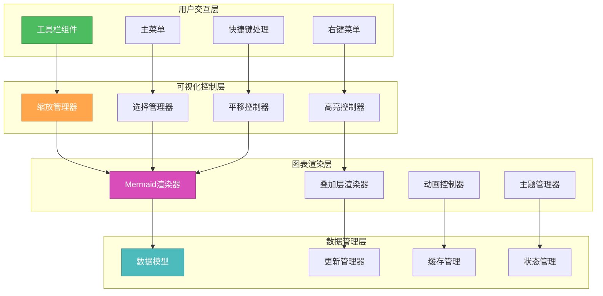

# 🎨🎨🎨 ENTERING CREATIVE PHASE: UI/UX DESIGN 🎨🎨🎨

## VS Code WebView ER图用户界面设计

### 问题陈述 (PROBLEM STATEMENT)

在VS Code环境中设计一个直观、高效的ER图展示和交互界面面临以下挑战：

1. **VS Code约束**: WebView的安全限制和功能局限性
2. **ER图复杂性**: 大型项目可能有数百个实体和关系，需要智能布局
3. **用户交互**: 在有限的界面空间内提供丰富的交互功能
4. **实时更新**: 代码变更时ER图的实时同步更新
5. **性能挑战**: 大型图表的渲染和交互性能
6. **跨平台兼容**: 确保在不同操作系统下的一致体验

**核心目标**: 设计一个现代化、响应式、高性能的ER图可视化界面，提供出色的用户体验。

### 需求分析 (REQUIREMENTS ANALYSIS)

#### 功能需求
- **图表展示**: 清晰的ER图可视化，支持实体、字段、关系显示
- **交互操作**: 缩放、拖拽、节点选择、关系高亮
- **实时更新**: 代码变更时图表自动更新
- **导出功能**: 支持PNG、SVG、PDF等格式导出
- **搜索过滤**: 快速定位特定实体或关系
- **布局算法**: 智能的自动布局和手动调整

#### 用户体验需求
- **响应速度**: 界面操作响应时间<100ms
- **可读性**: 清晰的视觉层次和信息组织
- **易用性**: 直观的操作方式，学习成本低
- **美观性**: 现代化的视觉设计
- **可访问性**: 支持键盘导航和屏幕阅读器

#### 技术约束
- **WebView限制**: 受VS Code WebView安全策略约束
- **Mermaid.js集成**: 必须基于Mermaid渲染引擎
- **性能要求**: 支持500+实体的流畅渲染
- **内存限制**: 界面内存占用<20MB

### UI设计选项分析 (OPTIONS ANALYSIS)

#### Option 1: 纯Mermaid展示方案
**描述**: 直接使用Mermaid.js渲染ER图，最小化自定义界面
```typescript
class SimpleMermaidUI {
  render(erDiagram: string): void {
    const webview = vscode.window.createWebviewPanel(
      'mybatis-er',
      'MyBatis ER Diagram',
      vscode.ViewColumn.Beside,
      { enableScripts: true }
    );
    
    webview.webview.html = `
      <div id="mermaid-container">${erDiagram}</div>
      <script src="mermaid.min.js"></script>
    `;
  }
}
```
**优点**:
- 实现简单快速
- 兼容性好
- 维护成本低
**缺点**:
- 交互功能有限
- 自定义能力差
- 用户体验一般
**技术适应性**: 高
**复杂度**: 低
**实现时间**: 1天

#### Option 2: 富交互仪表板方案
**描述**: 构建完整的管理界面，包含图表、侧边栏、工具栏等
```typescript
class RichDashboardUI {
  render(): void {
    const html = `
      <div class="er-dashboard">
        <div class="toolbar">/* 工具栏 */</div>
        <div class="sidebar">/* 实体列表 */</div>
        <div class="main-canvas">/* 主图表区域 */</div>
        <div class="property-panel">/* 属性面板 */</div>
      </div>
    `;
  }
}
```
**优点**:
- 功能丰富完整
- 用户体验优秀
- 高度可定制
**缺点**:
- 开发复杂度高
- 维护成本高
- 可能性能较差
**技术适应性**: 中等
**复杂度**: 高
**实现时间**: 7天

#### Option 3: 渐进式增强界面 (推荐)
**描述**: 以Mermaid为核心，逐步增加交互层和功能组件
```typescript
class ProgressiveEnhancedUI {
  render(): void {
    const baseLayer = this.renderMermaidLayer();
    const interactionLayer = this.renderInteractionLayer();
    const controlLayer = this.renderControlLayer();
    
    return this.combineLayers(baseLayer, interactionLayer, controlLayer);
  }
}
```
**优点**:
- 平衡功能和复杂度
- 可分阶段实现
- 性能和体验并重
**缺点**:
- 架构设计复杂
- 需要精心规划
**技术适应性**: 高
**复杂度**: 中等
**实现时间**: 4天

### 🎨 CREATIVE CHECKPOINT: UI方案选择

经过分析，我选择 **Option 3: 渐进式增强界面**，并设计创新的分层架构：

## 选定方案: 分层渐进式WebView界面

### 核心设计思想

#### 1. 🏗️ 四层架构设计


#### 2. 🎨 现代化界面设计
```typescript
class ModernERInterface {
  private layout = {
    toolbar: { height: 40, position: 'top' },
    sidebar: { width: 280, position: 'left', collapsible: true },
    mainCanvas: { flex: 1, minWidth: 600 },
    statusBar: { height: 24, position: 'bottom' }
  };
  
  generateHTML(): string {
    return `
      <!DOCTYPE html>
      <html lang="zh-CN">
      <head>
        <meta charset="UTF-8">
        <meta name="viewport" content="width=device-width, initial-scale=1.0">
        <title>MyBatis ER Diagram</title>
        <style>${this.getStyles()}</style>
      </head>
      <body>
        <div class="er-container">
          ${this.renderToolbar()}
          <div class="main-layout">
            ${this.renderSidebar()}
            ${this.renderMainCanvas()}
          </div>
          ${this.renderStatusBar()}
        </div>
        
        <!-- 模态对话框 -->
        ${this.renderDialogs()}
        
        <!-- 脚本 -->
        <script src="${this.getVSCodeApi()}"></script>
        <script src="${this.getMermaidLib()}"></script>
        <script>${this.getMainScript()}</script>
      </body>
      </html>
    `;
  }
}
```

#### 3. 🛠️ 智能工具栏设计
```typescript
class IntelligentToolbar {
  private tools = [
    {
      id: 'refresh',
      icon: '🔄',
      tooltip: '刷新图表',
      shortcut: 'Ctrl+R',
      action: () => this.refreshDiagram()
    },
    {
      id: 'zoom-fit',
      icon: '📐',
      tooltip: '适应窗口',
      shortcut: 'Ctrl+0',
      action: () => this.fitToWindow()
    },
    {
      id: 'search',
      icon: '🔍',
      tooltip: '搜索实体',
      shortcut: 'Ctrl+F',
      action: () => this.openSearch()
    },
    {
      id: 'export',
      icon: '📤',
      tooltip: '导出图表',
      shortcut: 'Ctrl+E',
      action: () => this.openExportDialog()
    },
    {
      id: 'settings',
      icon: '⚙️',
      tooltip: '设置',
      shortcut: 'Ctrl+,',
      action: () => this.openSettings()
    }
  ];
  
  render(): string {
    return `
      <div class="toolbar">
        <div class="toolbar-group">
          ${this.tools.map(tool => `
            <button 
              class="toolbar-btn" 
              id="${tool.id}"
              title="${tool.tooltip} (${tool.shortcut})"
              onclick="handleToolAction('${tool.id}')"
            >
              <span class="icon">${tool.icon}</span>
            </button>
          `).join('')}
        </div>
        
        <div class="toolbar-group toolbar-right">
          <div class="zoom-controls">
            <button onclick="zoomOut()">➖</button>
            <span class="zoom-level">100%</span>
            <button onclick="zoomIn()">➕</button>
          </div>
        </div>
      </div>
    `;
  }
}
```

#### 4. 📊 智能侧边栏设计
```typescript
class SmartSidebar {
  render(): string {
    return `
      <div class="sidebar ${this.isCollapsed ? 'collapsed' : ''}">
        <div class="sidebar-header">
          <h3>实体概览</h3>
          <button class="collapse-btn" onclick="toggleSidebar()">
            ${this.isCollapsed ? '👉' : '👈'}
          </button>
        </div>
        
        <div class="sidebar-content">
          <!-- 搜索框 -->
          <div class="search-box">
            <input 
              type="text" 
              placeholder="搜索实体..." 
              onkeyup="filterEntities(this.value)"
            />
          </div>
          
          <!-- 实体分组 -->
          <div class="entity-groups">
            ${this.renderEntityGroups()}
          </div>
          
          <!-- 关系统计 -->
          <div class="relation-stats">
            ${this.renderRelationStats()}
          </div>
        </div>
      </div>
    `;
  }
  
  private renderEntityGroups(): string {
    return this.entityGroups.map(group => `
      <div class="entity-group">
        <div class="group-header" onclick="toggleGroup('${group.id}')">
          <span class="expand-icon">${group.expanded ? '▼' : '▶'}</span>
          <span class="group-name">${group.name}</span>
          <span class="entity-count">(${group.entities.length})</span>
        </div>
        
        ${group.expanded ? `
          <div class="entity-list">
            ${group.entities.map(entity => `
              <div class="entity-item" 
                   onclick="selectEntity('${entity.id}')"
                   onmouseover="highlightEntity('${entity.id}')"
                   onmouseout="unhighlightEntity('${entity.id}')">
                <span class="entity-icon">🗂️</span>
                <span class="entity-name">${entity.name}</span>
                <span class="field-count">${entity.fields.length}</span>
              </div>
            `).join('')}
          </div>
        ` : ''}
      </div>
    `).join('');
  }
}
```

#### 5. 🎯 交互式主画布
```typescript
class InteractiveCanvas {
  private mermaidConfig = {
    theme: 'default',
    themeVariables: {
      primaryColor: '#4f46e5',
      primaryTextColor: '#1f2937',
      primaryBorderColor: '#6366f1',
      lineColor: '#6b7280',
      sectionBkgColor: '#f9fafb',
      altSectionBkgColor: '#ffffff',
      gridColor: '#e5e7eb',
      tertiaryColor: '#f3f4f6'
    },
    er: {
      diagramPadding: 20,
      layoutDirection: 'TB',
      fontSize: 12,
      useMaxWidth: true
    }
  };
  
  render(): string {
    return `
      <div class="main-canvas">
        <!-- 画布工具栏 -->
        <div class="canvas-toolbar">
          <div class="layout-controls">
            <select onchange="changeLayout(this.value)">
              <option value="TB">上下布局</option>
              <option value="LR">左右布局</option>
              <option value="auto">智能布局</option>
            </select>
          </div>
          
          <div class="view-controls">
            <button onclick="toggleMinimap()" title="小地图">🗺️</button>
            <button onclick="toggleGrid()" title="网格">⚏</button>
            <button onclick="toggleRelationLabels()" title="关系标签">🏷️</button>
          </div>
        </div>
        
        <!-- 主图表区域 -->
        <div class="diagram-container" id="diagram-container">
          <div class="mermaid-wrapper">
            <pre class="mermaid" id="mermaid-diagram">
              ${this.generateMermaidCode()}
            </pre>
          </div>
          
          <!-- 交互叠加层 -->
          <div class="interaction-overlay" id="interaction-overlay">
            <!-- 选择框 -->
            <div class="selection-box"></div>
            <!-- 连接线辅助 -->
            <svg class="connection-helper"></svg>
          </div>
        </div>
        
        <!-- 小地图 -->
        <div class="minimap ${this.showMinimap ? 'visible' : 'hidden'}">
          <canvas id="minimap-canvas"></canvas>
        </div>
      </div>
    `;
  }
}
```

#### 6. ⚡ 高性能渲染引擎
```typescript
class PerformantRenderEngine {
  private renderQueue: RenderTask[] = [];
  private isRendering = false;
  private lastRenderTime = 0;
  private readonly RENDER_THROTTLE = 16; // 60fps
  
  async renderDiagram(data: ERDiagramData): Promise<void> {
    // 添加到渲染队列
    this.renderQueue.push({
      type: 'full',
      data: data,
      timestamp: Date.now()
    });
    
    // 节流渲染
    if (!this.isRendering) {
      this.isRendering = true;
      requestAnimationFrame(() => this.processRenderQueue());
    }
  }
  
  private async processRenderQueue(): Promise<void> {
    const now = Date.now();
    
    // 防止过度渲染
    if (now - this.lastRenderTime < this.RENDER_THROTTLE) {
      requestAnimationFrame(() => this.processRenderQueue());
      return;
    }
    
    try {
      // 获取最新的渲染任务
      const latestTask = this.renderQueue[this.renderQueue.length - 1];
      this.renderQueue = [];
      
      if (latestTask) {
        await this.executeRender(latestTask);
      }
    } finally {
      this.lastRenderTime = now;
      this.isRendering = false;
      
      // 检查是否还有待处理任务
      if (this.renderQueue.length > 0) {
        requestAnimationFrame(() => this.processRenderQueue());
      }
    }
  }
  
  private async executeRender(task: RenderTask): Promise<void> {
    switch (task.type) {
      case 'full':
        await this.fullRender(task.data);
        break;
      case 'incremental':
        await this.incrementalRender(task.data);
        break;
      case 'highlight':
        await this.highlightRender(task.data);
        break;
    }
  }
}
```

#### 7. 🎨 动态主题系统
```typescript
class DynamicThemeSystem {
  private themes = {
    light: {
      name: '浅色主题',
      colors: {
        background: '#ffffff',
        surface: '#f9fafb',
        primary: '#4f46e5',
        secondary: '#6b7280',
        accent: '#10b981',
        text: '#1f2937',
        border: '#e5e7eb'
      }
    },
    dark: {
      name: '深色主题',
      colors: {
        background: '#1f2937',
        surface: '#374151',
        primary: '#6366f1',
        secondary: '#9ca3af',
        accent: '#34d399',
        text: '#f9fafb',
        border: '#4b5563'
      }
    },
    vscode: {
      name: 'VS Code主题',
      colors: 'inherit' // 继承VS Code主题
    }
  };
  
  applyTheme(themeName: string): void {
    const theme = this.themes[themeName];
    if (!theme) return;
    
    if (theme.colors === 'inherit') {
      this.inheritVSCodeTheme();
    } else {
      this.applyCustomTheme(theme.colors);
    }
    
    // 更新Mermaid主题
    this.updateMermaidTheme(theme);
  }
  
  private inheritVSCodeTheme(): void {
    // 从VS Code获取当前主题色彩
    const vscode = acquireVsCodeApi();
    const computedStyle = getComputedStyle(document.body);
    
    const colors = {
      background: computedStyle.getPropertyValue('--vscode-editor-background'),
      surface: computedStyle.getPropertyValue('--vscode-sideBar-background'),
      primary: computedStyle.getPropertyValue('--vscode-focusBorder'),
      text: computedStyle.getPropertyValue('--vscode-editor-foreground'),
      // ... 更多颜色映射
    };
    
    this.applyCustomTheme(colors);
  }
}
```

### 用户体验优化

#### 1. 🔍 智能搜索功能
```typescript
class IntelligentSearch {
  private searchIndex: SearchIndex;
  
  search(query: string): SearchResult[] {
    const results: SearchResult[] = [];
    
    // 实体名称匹配
    const entityMatches = this.searchIndex.entities.filter(entity =>
      entity.name.toLowerCase().includes(query.toLowerCase())
    );
    
    // 字段名称匹配
    const fieldMatches = this.searchIndex.fields.filter(field =>
      field.name.toLowerCase().includes(query.toLowerCase())
    );
    
    // 关系类型匹配
    const relationMatches = this.searchIndex.relations.filter(relation =>
      relation.type.toLowerCase().includes(query.toLowerCase())
    );
    
    return [...entityMatches, ...fieldMatches, ...relationMatches]
      .sort((a, b) => this.calculateRelevanceScore(b, query) - this.calculateRelevanceScore(a, query));
  }
  
  highlightSearchResults(query: string): void {
    const results = this.search(query);
    
    // 高亮匹配的实体
    results.forEach(result => {
      this.highlightElement(result.id, 'search-highlight');
    });
    
    // 自动聚焦到最佳匹配
    if (results.length > 0) {
      this.focusOnElement(results[0].id);
    }
  }
}
```

#### 2. 📱 响应式布局
```typescript
class ResponsiveLayout {
  private breakpoints = {
    mobile: 768,
    tablet: 1024,
    desktop: 1440
  };
  
  adaptLayout(): void {
    const width = window.innerWidth;
    
    if (width < this.breakpoints.mobile) {
      this.applyMobileLayout();
    } else if (width < this.breakpoints.tablet) {
      this.applyTabletLayout();
    } else {
      this.applyDesktopLayout();
    }
  }
  
  private applyMobileLayout(): void {
    // 隐藏侧边栏，使用抽屉式导航
    this.sidebar.setMode('drawer');
    this.toolbar.setCompactMode(true);
    this.canvas.setTouchOptimized(true);
  }
}
```

### 性能优化策略

#### 虚拟化大型图表
```typescript
class VirtualizedDiagram {
  private viewport: ViewportManager;
  private renderBounds: Rectangle;
  
  updateVisibleElements(): void {
    const visibleBounds = this.viewport.getVisibleBounds();
    const elementsInView = this.spatialIndex.query(visibleBounds);
    
    // 只渲染可见区域的元素
    this.renderElements(elementsInView);
    
    // 预渲染即将进入视野的元素
    const preloadBounds = this.expandBounds(visibleBounds, 100);
    const preloadElements = this.spatialIndex.query(preloadBounds);
    this.preloadElements(preloadElements);
  }
}
```

### 可访问性设计

#### 键盘导航支持
```typescript
class KeyboardNavigation {
  private keyMappings = {
    'ArrowUp': () => this.selectPreviousEntity(),
    'ArrowDown': () => this.selectNextEntity(),
    'ArrowLeft': () => this.selectLeftEntity(),
    'ArrowRight': () => this.selectRightEntity(),
    'Enter': () => this.activateSelectedEntity(),
    'Escape': () => this.clearSelection(),
    'Tab': () => this.focusNextInteractive(),
    ' ': () => this.toggleSelectedEntity()
  };
  
  handleKeyDown(event: KeyboardEvent): void {
    const handler = this.keyMappings[event.code];
    if (handler) {
      event.preventDefault();
      handler();
    }
  }
}
```

## 🎨🎨🎨 EXITING CREATIVE PHASE - DECISION MADE 🎨🎨🎨

**最终决策**: 采用分层渐进式WebView界面

**核心优势**:
1. **现代化设计**: 美观的界面设计，符合现代Web应用标准
2. **高性能**: 虚拟化渲染，支持大型图表流畅交互
3. **丰富交互**: 搜索、过滤、导出、主题切换等完整功能
4. **响应式**: 适配不同屏幕尺寸，移动端友好
5. **可访问性**: 支持键盘导航和屏幕阅读器
6. **VS Code集成**: 深度集成VS Code主题和工作流

**技术创新点**:
- 四层渐进式架构设计
- 智能性能优化和虚拟化
- 动态主题系统
- 高级搜索和过滤功能

**实现复杂度**: 中等，分阶段可实现

**下一步**: 进入IMPLEMENT模式开始编码实现 