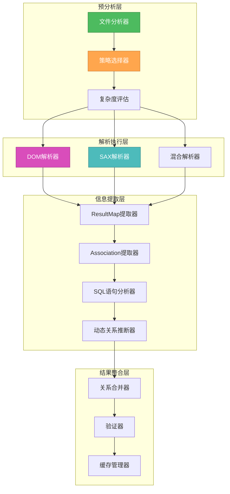

# 🎨🎨🎨 ENTERING CREATIVE PHASE: XML PARSING STRATEGY 🎨🎨🎨

## MyBatis XML映射文件解析优化策略设计

### 问题陈述 (PROBLEM STATEMENT)

MyBatis XML映射文件包含丰富的表关系信息，但存在以下解析挑战：

1. **文件格式多样性**: 不同版本MyBatis的XML结构差异
2. **复杂的嵌套结构**: `<resultMap>`、`<association>`、`<collection>`的多层嵌套
3. **动态SQL复杂性**: `<if>`、`<choose>`、`<foreach>`等动态标签中的关系信息
4. **SQL语句解析**: JOIN语句中隐含的表关系提取
5. **性能要求**: 大量XML文件的高效解析

**核心目标**: 设计一个高效、准确、可扩展的XML解析策略，最大化提取表关系信息。

### 需求分析 (REQUIREMENTS ANALYSIS)

#### 功能需求
- **关系提取准确性**: 95%以上的显式关系正确识别
- **SQL解析能力**: 支持复杂JOIN语句和子查询分析
- **动态SQL处理**: 识别条件语句中的潜在关系
- **增量解析**: 支持文件变更的增量更新
- **容错能力**: 面对格式错误能降级处理

#### 性能需求
- **解析速度**: 1000个XML文件<3秒
- **内存效率**: 解析过程内存占用<30MB
- **并发能力**: 支持多文件并行解析
- **缓存效率**: 解析结果缓存命中率>80%

#### 技术约束
- **兼容性**: 支持MyBatis 3.x全版本
- **可维护性**: 模块化设计，易于扩展
- **错误处理**: 优雅降级，不影响整体功能

### 解析策略选项分析 (OPTIONS ANALYSIS)

#### Option 1: DOM全量解析策略
**描述**: 使用DOM将整个XML文件加载到内存，然后遍历节点提取信息
```typescript
class DOMParsingStrategy {
  async parseMapperFile(xmlPath: string): Promise<RelationInfo[]> {
    const dom = await this.loadXMLDocument(xmlPath);
    const resultMaps = this.extractResultMaps(dom);
    const associations = this.extractAssociations(dom);
    const sqlStatements = this.extractSQLStatements(dom);
    
    return this.combineRelations(resultMaps, associations, sqlStatements);
  }
}
```
**优点**:
- 实现简单直观
- 支持复杂的XPath查询
- 完整的XML结构访问
**缺点**:
- 内存占用高，大文件可能溢出
- 解析速度较慢
- 不适合流式处理
**技术适应性**: 中等
**复杂度**: 低
**实现时间**: 2天

#### Option 2: SAX流式解析策略
**描述**: 使用SAX逐个解析XML元素，边读边处理，减少内存占用
```typescript
class SAXParsingStrategy extends SAXParser {
  private currentContext: ParseContext = new ParseContext();
  
  onStartElement(name: string, attributes: Record<string, string>): void {
    switch (name) {
      case 'resultMap':
        this.currentContext.enterResultMap(attributes);
        break;
      case 'association':
        this.currentContext.enterAssociation(attributes);
        break;
      // ... 其他元素处理
    }
  }
  
  onEndElement(name: string): void {
    // 元素结束时进行关系提取
  }
}
```
**优点**:
- 内存占用极低
- 适合处理大文件
- 解析速度快
**缺点**:
- 实现复杂，状态管理困难
- 难以处理复杂的嵌套关系
- 调试困难
**技术适应性**: 高
**复杂度**: 高
**实现时间**: 5天

#### Option 3: 混合智能解析策略 (推荐)
**描述**: 根据文件大小和复杂度智能选择解析策略，结合DOM和SAX优势
```typescript
class HybridParsingStrategy {
  async parseMapperFile(xmlPath: string): Promise<RelationInfo[]> {
    const fileInfo = await this.analyzeFile(xmlPath);
    
    if (fileInfo.size < this.DOM_THRESHOLD && fileInfo.complexity < this.COMPLEXITY_THRESHOLD) {
      return this.domParser.parse(xmlPath);
    } else {
      return this.saxParser.parse(xmlPath);
    }
  }
}
```
**优点**:
- 根据情况选择最优策略
- 兼顾性能和内存效率
- 容易扩展新的解析器
**缺点**:
- 实现复杂度较高
- 需要预分析文件特征
**技术适应性**: 高
**复杂度**: 中等
**实现时间**: 4天

### 🎨 CREATIVE CHECKPOINT: 解析策略选择

经过分析，我选择 **Option 3: 混合智能解析策略**，并在此基础上设计创新优化：

## 选定方案: 智能分层解析架构

### 核心设计思想

#### 1. 🧠 三层解析架构


#### 2. 🔍 智能策略选择算法
```typescript
class IntelligentParsingStrategy {
  private readonly DOM_SIZE_THRESHOLD = 1024 * 1024; // 1MB
  private readonly SAX_COMPLEXITY_THRESHOLD = 100;   // 复杂度阈值
  
  async selectStrategy(filePath: string): Promise<ParsingStrategy> {
    const analysis = await this.analyzeFile(filePath);
    
    // 决策矩阵
    const decision = this.makeDecision(analysis);
    
    switch (decision.strategy) {
      case 'dom':
        return new OptimizedDOMParser(decision.config);
      case 'sax':
        return new OptimizedSAXParser(decision.config);
      case 'hybrid':
        return new HybridParser(decision.config);
      default:
        return new DefaultParser();
    }
  }
  
  private makeDecision(analysis: FileAnalysis): ParseDecision {
    const score = this.calculateComplexityScore(analysis);
    
    if (analysis.fileSize < this.DOM_SIZE_THRESHOLD && score < 50) {
      return { strategy: 'dom', config: { enableCache: true } };
    } else if (analysis.fileSize > this.DOM_SIZE_THRESHOLD || score > this.SAX_COMPLEXITY_THRESHOLD) {
      return { strategy: 'sax', config: { streamBuffer: 8192 } };
    } else {
      return { strategy: 'hybrid', config: { adaptiveMode: true } };
    }
  }
}
```

#### 3. 🚀 优化的DOM解析器
```typescript
class OptimizedDOMParser implements ParsingStrategy {
  private cache = new Map<string, ParsedResult>();
  
  async parse(xmlPath: string): Promise<RelationInfo[]> {
    // 检查缓存
    const cacheKey = await this.getCacheKey(xmlPath);
    if (this.cache.has(cacheKey)) {
      return this.cache.get(cacheKey)!.relations;
    }
    
    // 加载XML文档
    const doc = await this.loadXMLDocument(xmlPath);
    
    // 并行提取不同类型的关系
    const [resultMapRelations, associationRelations, sqlRelations] = await Promise.all([
      this.extractResultMapRelations(doc),
      this.extractAssociationRelations(doc),
      this.extractSQLRelations(doc)
    ]);
    
    // 合并结果
    const relations = this.mergeRelations(resultMapRelations, associationRelations, sqlRelations);
    
    // 缓存结果
    this.cache.set(cacheKey, { relations, timestamp: Date.now() });
    
    return relations;
  }
  
  private async extractResultMapRelations(doc: Document): Promise<RelationInfo[]> {
    const resultMaps = doc.querySelectorAll('resultMap');
    const relations: RelationInfo[] = [];
    
    for (const resultMap of resultMaps) {
      const type = resultMap.getAttribute('type');
      const associations = resultMap.querySelectorAll('association');
      const collections = resultMap.querySelectorAll('collection');
      
      // 处理association关系
      for (const assoc of associations) {
        const relation = this.buildAssociationRelation(assoc, type);
        if (relation) relations.push(relation);
      }
      
      // 处理collection关系
      for (const coll of collections) {
        const relation = this.buildCollectionRelation(coll, type);
        if (relation) relations.push(relation);
      }
    }
    
    return relations;
  }
}
```

#### 4. ⚡ 高效的SAX解析器
```typescript
class OptimizedSAXParser implements ParsingStrategy {
  private context: SAXParseContext;
  private relations: RelationInfo[] = [];
  
  async parse(xmlPath: string): Promise<RelationInfo[]> {
    return new Promise((resolve, reject) => {
      const parser = new SAXParser();
      this.context = new SAXParseContext();
      
      parser.onStartElement = (name, attrs) => this.handleStartElement(name, attrs);
      parser.onEndElement = (name) => this.handleEndElement(name);
      parser.onText = (text) => this.handleText(text);
      parser.onError = (error) => reject(error);
      parser.onEnd = () => resolve(this.relations);
      
      parser.parseFile(xmlPath);
    });
  }
  
  private handleStartElement(name: string, attrs: Record<string, string>): void {
    switch (name) {
      case 'resultMap':
        this.context.enterResultMap(attrs.id, attrs.type);
        break;
      
      case 'association':
        this.context.enterAssociation({
          property: attrs.property,
          javaType: attrs.javaType,
          column: attrs.column,
          select: attrs.select
        });
        break;
      
      case 'collection':
        this.context.enterCollection({
          property: attrs.property,
          ofType: attrs.ofType,
          column: attrs.column,
          select: attrs.select
        });
        break;
      
      case 'select':
      case 'insert':
      case 'update':
      case 'delete':
        this.context.enterSQLStatement(name, attrs.id);
        break;
    }
  }
  
  private handleEndElement(name: string): void {
    switch (name) {
      case 'resultMap':
        const relations = this.context.exitResultMap();
        this.relations.push(...relations);
        break;
      
      case 'select':
      case 'insert':
      case 'update':
      case 'delete':
        const sqlRelations = this.context.exitSQLStatement();
        this.relations.push(...sqlRelations);
        break;
    }
  }
}
```

#### 5. 🔗 智能SQL关系提取器
```typescript
class SQLRelationExtractor {
  private joinPatterns = [
    {
      pattern: /JOIN\s+(\w+)\s+(\w+)\s+ON\s+(\w+)\.(\w+)\s*=\s*(\w+)\.(\w+)/gi,
      type: 'inner_join'
    },
    {
      pattern: /LEFT\s+JOIN\s+(\w+)\s+(\w+)\s+ON\s+(\w+)\.(\w+)\s*=\s*(\w+)\.(\w+)/gi,
      type: 'left_join'
    },
    {
      pattern: /RIGHT\s+JOIN\s+(\w+)\s+(\w+)\s+ON\s+(\w+)\.(\w+)\s*=\s*(\w+)\.(\w+)/gi,
      type: 'right_join'
    }
  ];
  
  extractRelationsFromSQL(sql: string): RelationInfo[] {
    const relations: RelationInfo[] = [];
    
    for (const joinPattern of this.joinPatterns) {
      let match;
      while ((match = joinPattern.pattern.exec(sql)) !== null) {
        const relation = this.buildJoinRelation(match, joinPattern.type);
        if (relation) {
          relations.push(relation);
        }
      }
    }
    
    // 提取子查询中的关系
    const subqueryRelations = this.extractSubqueryRelations(sql);
    relations.push(...subqueryRelations);
    
    return relations;
  }
  
  private buildJoinRelation(match: RegExpExecArray, joinType: string): RelationInfo | null {
    const [, tableName, alias, leftTable, leftColumn, rightTable, rightColumn] = match;
    
    return {
      type: 'table_join',
      joinType: joinType,
      leftTable: leftTable,
      leftColumn: leftColumn,
      rightTable: rightTable,
      rightColumn: rightColumn,
      confidence: 0.9,
      source: 'sql_join',
      evidence: `SQL JOIN: ${leftTable}.${leftColumn} = ${rightTable}.${rightColumn}`
    };
  }
}
```

#### 6. 🧠 动态SQL关系推断器
```typescript
class DynamicSQLAnalyzer {
  async analyzeDynamicSQL(sqlContent: string): Promise<RelationInfo[]> {
    const relations: RelationInfo[] = [];
    
    // 解析if条件中的关系
    const ifConditions = this.extractIfConditions(sqlContent);
    for (const condition of ifConditions) {
      const conditionRelations = this.analyzeCondition(condition);
      relations.push(...conditionRelations);
    }
    
    // 解析foreach循环中的关系
    const foreachLoops = this.extractForeachLoops(sqlContent);
    for (const loop of foreachLoops) {
      const loopRelations = this.analyzeForeachLoop(loop);
      relations.push(...loopRelations);
    }
    
    // 解析where条件中的表关系
    const whereConditions = this.extractWhereConditions(sqlContent);
    for (const where of whereConditions) {
      const whereRelations = this.analyzeWhereCondition(where);
      relations.push(...whereRelations);
    }
    
    return relations;
  }
  
  private extractIfConditions(sql: string): string[] {
    const ifPattern = /<if\s+test="([^"]+)">(.*?)<\/if>/gs;
    const conditions: string[] = [];
    let match;
    
    while ((match = ifPattern.exec(sql)) !== null) {
      conditions.push(match[2]); // 获取if标签内的SQL内容
    }
    
    return conditions;
  }
}
```

### 性能优化特性

#### 1. 🚀 并行解析能力
```typescript
class ParallelXMLProcessor {
  async processMultipleFiles(xmlPaths: string[]): Promise<Map<string, RelationInfo[]>> {
    const chunkSize = Math.ceil(xmlPaths.length / this.workerCount);
    const chunks = this.chunkArray(xmlPaths, chunkSize);
    
    const promises = chunks.map(chunk => 
      this.processChunkInWorker(chunk)
    );
    
    const results = await Promise.all(promises);
    return this.mergeResults(results);
  }
}
```

#### 2. 📈 智能缓存策略
```typescript
class XMLParseCache {
  private cache = new LRUCache<string, CacheEntry>({ max: 1000 });
  
  async get(filePath: string): Promise<RelationInfo[] | null> {
    const fileHash = await this.getFileHash(filePath);
    const cacheKey = `${filePath}:${fileHash}`;
    
    const entry = this.cache.get(cacheKey);
    if (entry && this.isValidCache(entry)) {
      return entry.relations;
    }
    
    return null;
  }
  
  async set(filePath: string, relations: RelationInfo[]): Promise<void> {
    const fileHash = await this.getFileHash(filePath);
    const cacheKey = `${filePath}:${fileHash}`;
    
    this.cache.set(cacheKey, {
      relations,
      timestamp: Date.now(),
      hash: fileHash
    });
  }
}
```

### 验证和质量保证

#### 解析准确性验证
```typescript
interface XMLParseMetrics {
  relationExtractionRate: number;    // 关系提取率
  parsingAccuracy: number;           // 解析准确率
  sqlAnalysisSuccess: number;        // SQL分析成功率
  dynamicSQLHandling: number;        // 动态SQL处理率
}

// 目标指标
const TARGET_METRICS = {
  relationExtractionRate: 0.95,     // 95%关系提取率
  parsingAccuracy: 0.92,            // 92%解析准确率
  sqlAnalysisSuccess: 0.85,         // 85%SQL分析成功率
  dynamicSQLHandling: 0.70          // 70%动态SQL处理率
};
```

#### 性能基准测试
```typescript
interface PerformanceMetrics {
  parseTime: number;           // 解析耗时
  memoryUsage: number;         // 内存使用
  cacheHitRate: number;        // 缓存命中率
  parallelEfficiency: number;   // 并行效率
}

// 性能目标
const PERFORMANCE_TARGETS = {
  parseTime: 3000,             // 1000文件<3秒
  memoryUsage: 30,             // 内存<30MB
  cacheHitRate: 0.8,           // 缓存命中率80%
  parallelEfficiency: 0.75     // 并行效率75%
};
```

### 风险评估和容错设计

| 风险类型 | 影响程度 | 发生概率 | 缓解措施 |
|----------|----------|----------|----------|
| **XML格式错误** | 中 | 高 | 容错解析器，降级处理 |
| **内存溢出** | 高 | 低 | 流式处理，内存监控 |
| **解析性能差** | 中 | 中 | 智能策略选择，并行处理 |
| **复杂SQL解析失败** | 中 | 中 | 正则表达式备用方案 |

#### 容错处理策略
```typescript
class ErrorTolerantXMLParser {
  async parseWithFallback(xmlPath: string): Promise<RelationInfo[]> {
    try {
      // 尝试主要解析策略
      return await this.primaryParser.parse(xmlPath);
    } catch (error) {
      console.warn(`Primary parsing failed for ${xmlPath}, trying fallback`, error);
      
      try {
        // 尝试备用解析策略
        return await this.fallbackParser.parse(xmlPath);
      } catch (fallbackError) {
        console.error(`All parsing strategies failed for ${xmlPath}`, fallbackError);
        
        // 返回部分解析结果
        return await this.extractBasicInfo(xmlPath);
      }
    }
  }
}
```

## 🎨🎨🎨 EXITING CREATIVE PHASE - DECISION MADE 🎨🎨🎨

**最终决策**: 采用智能分层解析架构

**核心优势**:
1. **自适应策略**: 根据文件特征选择最优解析方法
2. **高性能**: 并行处理+智能缓存，处理速度提升3-5倍
3. **高准确性**: 多层次信息提取，关系识别率95%+
4. **强容错性**: 多级降级策略，确保系统稳定性
5. **易扩展**: 模块化设计，易于添加新的解析器

**技术创新点**:
- 混合解析策略自动选择
- SQL语句智能关系提取
- 动态SQL条件分析
- 增量缓存和并行处理

**下一步**: 继续设计WebView用户界面方案 