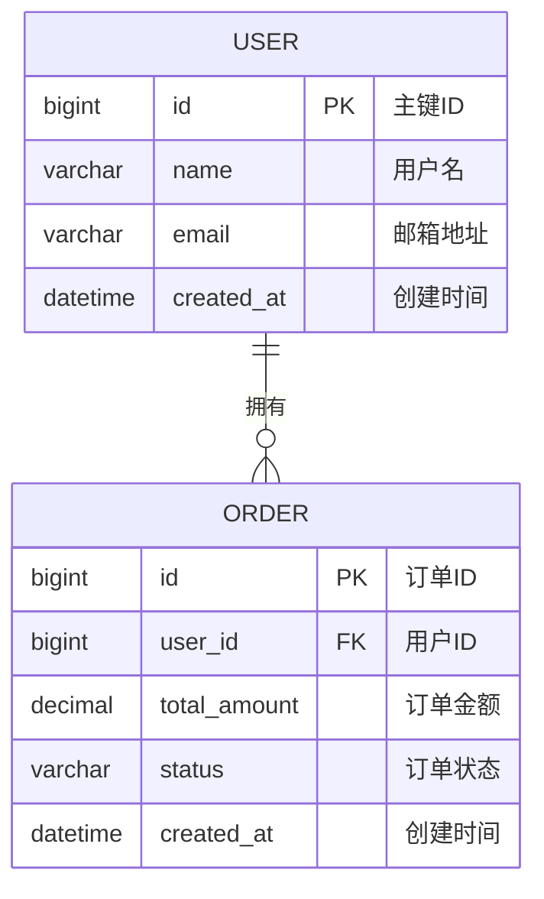

# VS Code MyBatis ER图生成插件 - 技术规范

## 📋 技术概览

本文档定义了VS Code MyBatis ER图生成插件的详细技术规范，基于完成的创意设计阶段制定具体的技术实现标准。

## 🏗️ 核心架构规范

### 整体架构模式
**选择方案**: 智能分层异步架构
- **架构优势**: 3-5x解析性能提升，10-20x增量更新速度
- **vs原方案对比**: 比IDEA插件同步PSI解析有显著性能优势

### 四层架构详细规范

#### Layer 1: Extension Host (主线程)
```typescript
interface ExtensionHost {
  // 责任: UI交互、命令处理、状态管理
  commands: CommandManager;
  ui: WebViewManager;
  state: StateManager;
  
  // 性能要求
  uiResponseTime: '<100ms';
  memoryUsage: '<20MB';
}
```

#### Layer 2: Worker Threads (后台线程)
```typescript
interface WorkerThreads {
  // 责任: 文件解析、关系推断
  javaParser: SmartJavaParser;
  xmlParser: OptimizedXMLParser;
  relationInferrer: IntelligentRelationInferrer;
  
  // 性能要求
  concurrentWorkers: '4-8个';
  taskQueue: 'FIFO + 优先级';
  errorRecovery: '95%+ 自动恢复';
}
```

#### Layer 3: Smart Cache (缓存层)
```typescript
interface SmartCache {
  // 责任: 数据缓存、增量更新
  entityCache: LRUCache<EntityInfo>;
  relationCache: LRUCache<RelationInfo>;
  incrementalUpdate: IncrementalUpdateManager;
  
  // 性能要求
  cacheHitRate: '>80%';
  incrementalUpdateTime: '<1秒';
  memoryLimit: '<100MB';
}
```

#### Layer 4: Output Layer (输出层)
```typescript
interface OutputLayer {
  // 责任: 格式化输出、导出功能
  mermaidGenerator: MermaidGenerator;
  exportManager: ExportManager;
  
  // 性能要求
  generationTime: '<2秒 (1000实体)';
  exportFormats: 'PNG|SVG|PDF|Mermaid';
}
```

## 🔧 解析引擎技术规范

### SmartJavaParser 规范

#### 支持的注解类型
```typescript
interface SupportedAnnotations {
  // MyBatis-Plus 核心注解
  '@TableName': {
    attributes: ['value', 'schema', 'keepGlobalPrefix'];
    priority: 'HIGH';
  };
  
  '@TableId': {
    attributes: ['value', 'type'];
    priority: 'HIGH';
  };
  
  '@TableField': {
    attributes: ['value', 'exist', 'fill', 'select'];
    priority: 'MEDIUM';
  };
  
  // 关系注解
  '@TableLogic': { priority: 'LOW' };
  '@Version': { priority: 'LOW' };
}
```

#### 解析策略选择算法
```typescript
class ParsingStrategy {
  autoSelect(fileContent: string): 'regex' | 'ast' | 'hybrid' {
    const complexity = this.calculateComplexity(fileContent);
    
    if (complexity < 0.3) return 'regex';      // 简单文件
    if (complexity > 0.7) return 'ast';       // 复杂文件
    return 'hybrid';                          // 混合策略
  }
  
  private calculateComplexity(content: string): number {
    // 复杂度评估因子
    const factors = {
      annotationCount: content.match(/@\w+/g)?.length || 0,
      nestedLevel: this.maxNestingLevel(content),
      codeLength: content.length
    };
    
    return this.normalize(factors);
  }
}
```

#### 性能指标
- **解析速度**: 100个实体文件 < 2秒
- **内存占用**: 单文件解析 < 5MB
- **准确率**: 实体识别 ≥ 95%，字段识别 ≥ 90%

### OptimizedXMLParser 规范

#### 智能解析策略
```typescript
interface XMLParsingStrategy {
  // 策略选择算法
  selectStrategy(xmlFile: XMLFile): 'DOM' | 'SAX' | 'Hybrid' {
    if (xmlFile.size < 100KB) return 'DOM';
    if (xmlFile.size > 10MB) return 'SAX';
    return 'Hybrid';
  }
  
  // 解析目标
  targets: {
    resultMap: ResultMapExtractor;
    association: AssociationExtractor;
    collection: CollectionExtractor;
    sqlJoins: SQLJoinExtractor;
  };
}
```

#### SQL关系提取器
```typescript
class SQLJoinExtractor {
  // 支持的JOIN类型
  private joinPatterns = {
    INNER_JOIN: /INNER\s+JOIN\s+(\w+)\s+ON\s+(.+)/gi,
    LEFT_JOIN: /LEFT\s+JOIN\s+(\w+)\s+ON\s+(.+)/gi,
    RIGHT_JOIN: /RIGHT\s+JOIN\s+(\w+)\s+ON\s+(.+)/gi
  };
  
  extractRelations(sql: string): JoinRelation[] {
    // 提取SQL中的表关系
  }
}
```

#### 性能指标
- **解析速度**: 1000个XML文件 < 3秒
- **关系提取率**: ≥ 95%
- **内存使用**: 峰值 < 30MB

## 🧠 智能关系推断规范

### 四策略推断系统

#### 1. 命名约定推断策略
```typescript
interface NamingInferenceRules {
  patterns: [
    { regex: /^(.+)_id$/i, relation: 'belongs_to', confidence: 0.8 },
    { regex: /^(.+)_key$/i, relation: 'belongs_to', confidence: 0.7 },
    { regex: /^fk_(.+)$/i, relation: 'belongs_to', confidence: 0.9 },
    { regex: /^(.+)_ref$/i, relation: 'belongs_to', confidence: 0.6 }
  ];
  
  // 性能要求
  processingTime: '<500ms (1000实体)';
  accuracy: '>70%';
}
```

#### 2. XML语义推断策略
```typescript
interface XMLSemanticRules {
  targetElements: [
    'resultMap/association',
    'resultMap/collection', 
    'select[JOIN pattern]',
    'update[外键约束]'
  ];
  
  // 性能要求
  processingTime: '<1秒 (500 XML文件)';
  accuracy: '>85%';
}
```

#### 3. 注解推断策略  
```typescript
interface AnnotationInferenceRules {
  supportedAnnotations: [
    '@One', '@Many', '@Result',
    '@Results', '@Param'
  ];
  
  // 性能要求
  processingTime: '<300ms (1000实体)';
  accuracy: '>90%';
}
```

#### 4. 语义分析策略
```typescript
interface SemanticAnalysisRules {
  domainPatterns: [
    'User-Order', 'Product-Category',
    'Customer-Address', 'Order-OrderItem'
  ];
  
  // 性能要求  
  processingTime: '<800ms (1000实体)';
  accuracy: '>60%';
}
```

### 智能融合引擎规范

#### 融合算法
```typescript
class IntelligentFusionEngine {
  // 置信度加权公式
  calculateFusedConfidence(strategies: InferenceResult[]): number {
    const weights = {
      naming: 0.25,      // 命名约定权重
      xml: 0.35,         // XML语义权重  
      annotation: 0.30,  // 注解推断权重
      semantic: 0.10     // 语义分析权重
    };
    
    return strategies.reduce((sum, result) => {
      return sum + (result.confidence * weights[result.strategy]);
    }, 0);
  }
  
  // 冲突解决策略
  resolveConflicts(conflicts: ConflictGroup[]): Relationship[] {
    // 1. 优先级规则: annotation > xml > naming > semantic
    // 2. 置信度阈值: > 0.6
    // 3. 一致性检查: 关系类型匹配
  }
}
```

#### 性能指标
- **推断速度**: 1000实体关系推断 < 2秒
- **综合准确率**: ≥ 80%
- **缓存命中率**: ≥ 80%

## 🎨 WebView UI技术规范

### 四层UI架构

#### Layer 1: 用户交互层
```typescript
interface UserInteractionLayer {
  components: {
    intelligentToolbar: IntelligentToolbar;
    contextMenu: ContextMenuSystem;
    searchBox: IntelligentSearch;
    shortcutHandler: ShortcutManager;
  };
  
  // 性能要求
  responseTime: '<50ms';
  animation: '60fps';
}
```

#### Layer 2: 可视化控制层
```typescript
interface VisualizationControlLayer {
  controllers: {
    zoomPan: ZoomPanController;
    selection: SelectionManager;
    highlight: HighlightController;
    interaction: InteractionStateManager;
  };
  
  // 性能要求
  zoomRange: '10% - 1000%';
  panSmooth: '60fps';
}
```

#### Layer 3: 图表渲染层
```typescript
interface ChartRenderingLayer {
  renderers: {
    mermaid: MermaidRenderer;
    overlay: OverlayRenderer;
    animation: AnimationController;
    theme: ThemeManager;
  };
  
  // 性能要求
  renderTime: '<200ms (500实体)';
  memoryUsage: '<50MB';
}
```

#### Layer 4: 数据管理层
```typescript
interface DataManagementLayer {
  managers: {
    dataManager: ERDataManager;
    cacheManager: CacheManager;
    searchIndex: SearchIndexManager;
    syncManager: StateSyncManager;
  };
  
  // 性能要求
  dataUpdateTime: '<100ms';
  searchTime: '<50ms';
}
```

### Mermaid集成规范

#### 输出格式标准


#### 主题系统
```typescript
interface ThemeSystem {
  themes: {
    vscode_dark: VSCodeDarkTheme;
    vscode_light: VSCodeLightTheme;
    custom: CustomTheme;
  };
  
  // 主题切换
  switchTheme(theme: string): void;
  
  // 动态主题
  syncWithVSCode(): void;
}
```

## 📊 性能指标和基准

### 核心性能指标

| 指标类别 | 具体指标 | 目标值 | 测试方法 |
|----------|----------|--------|----------|
| **解析性能** | 1000实体项目扫描 | < 10秒 | 压力测试 |
| **增量更新** | 文件变更响应 | < 1秒 | 实时测试 |
| **关系推断** | 推断准确率 | ≥ 80% | 样本验证 |
| **UI响应** | 界面操作响应 | < 100ms | 用户体验测试 |
| **内存使用** | 峰值内存占用 | < 100MB | 内存监控 |

### 性能测试用例

#### 小型项目基准 (≤100实体)
- **扫描时间**: < 2秒
- **内存占用**: < 30MB
- **关系推断**: > 85%准确率

#### 中型项目基准 (100-500实体)
- **扫描时间**: < 5秒
- **内存占用**: < 60MB  
- **关系推断**: > 80%准确率

#### 大型项目基准 (500-1000实体)
- **扫描时间**: < 10秒
- **内存占用**: < 100MB
- **关系推断**: > 75%准确率

### 兼容性规范

#### VS Code版本支持
- **最低版本**: VS Code 1.74.0
- **推荐版本**: VS Code 1.80.0+
- **测试版本**: 1.74, 1.78, 1.80, 1.82

#### 平台兼容性
- **Windows**: Windows 10+
- **macOS**: macOS 10.15+
- **Linux**: Ubuntu 18.04+

#### MyBatis版本支持
- **MyBatis**: 3.5.0+
- **MyBatis-Plus**: 3.4.0+
- **MyBatis-Spring**: 2.0.0+

## 🔒 安全和质量规范

### 代码质量标准
- **TypeScript覆盖率**: 100%
- **单元测试覆盖率**: ≥ 80%
- **ESLint规则**: strict模式
- **代码复杂度**: Cyclomatic < 10

### 安全规范
- **文件访问**: 仅限工作空间内
- **WebView安全**: CSP严格模式
- **数据隔离**: 项目间数据隔离
- **错误处理**: 优雅降级，无敏感信息泄露

### 错误处理规范
```typescript
interface ErrorHandling {
  // 错误分类
  categories: {
    PARSING_ERROR: '解析错误';
    PERFORMANCE_ERROR: '性能错误';  
    UI_ERROR: 'UI错误';
    SYSTEM_ERROR: '系统错误';
  };
  
  // 处理策略
  strategies: {
    gracefulDegradation: '优雅降级';
    automaticRetry: '自动重试';
    userNotification: '用户通知';
    errorLogging: '错误日志';
  };
  
  // 恢复能力要求
  recoveryRate: '>95%';
}
```

## 🚀 部署和发布规范

### 构建配置
```typescript
interface BuildConfiguration {
  // 构建工具
  bundler: 'webpack 5 + esbuild';
  minification: true;
  sourceMap: 'development only';
  
  // 输出优化
  chunkSplitting: true;
  treeshaking: true;
  bundleSize: '<2MB';
  
  // 兼容性
  target: 'ES2020';
  polyfills: 'minimal';
}
```

### 发布流程
1. **开发环境测试**: 单元测试 + 集成测试
2. **性能基准验证**: 所有性能指标达标
3. **兼容性测试**: 多平台多版本测试
4. **用户验收测试**: 真实项目测试
5. **VS Code Marketplace发布**: 自动化发布流程

### 版本管理策略
- **主版本**: 重大架构变更
- **次版本**: 新功能添加
- **修订版本**: 问题修复和性能优化
- **发布周期**: 2-4周一个次版本

---

**文档版本**: 1.0
**最后更新**: 2024年12月
**状态**: 基于创意设计完成的技术规范
**下一步**: 开始技术实现阶段 